<div align="center">

# 🌐 PRISM — Parcel Recognition & Intelligent Spatial Mapping
### *Next-Generation AI Aerial Photogrammetry, Automated Cadastral Vectorization & Spatial Deed Intelligence*

[](https://nextjs.org/)
[](https://nestjs.com/)
[](https://www.typescriptlang.org/)
[](https://pytorch.org/)
[](https://www.ogc.org/)
[](https://epsg.io/4326)

<br/>

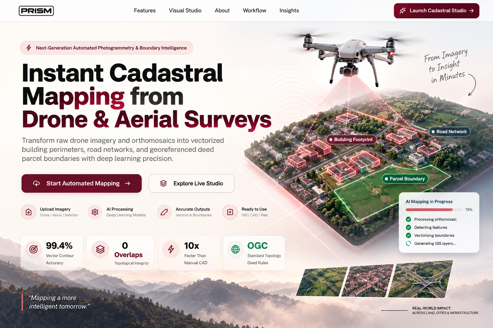

<br/>

> **"Turning raw drone imagery into intelligent, survey-grade, GIS-ready cadastral maps in seconds."**

</div>

---

## 📑 Table of Contents
1. [Executive Summary & Problem Statement](#-the-problem-statement)
2. [The PRISM Solution & Core Philosophy](#-the-prism-solution)
3. [System Architecture & 8-Stage Cadastral Pipeline](#-system-architecture--8-stage-cadastral-pipeline)
4. [AI Multi-Modal Decomposition Studio](#-ai-multi-modal-decomposition-studio)
5. [Deep Learning Validation & Model Performance](#-deep-learning-validation--model-performance)
6. [Visual Survey Results Across Diverse Landscapes](#-visual-survey-results-across-diverse-landscapes)
7. [Key Platform Features](#-key-platform-features)
8. [Technology Stack](#-technology-stack)
9. [Project Directory Structure](#-project-directory-structure)
10. [Comprehensive Setup & Installation Guide](#-comprehensive-setup--installation-guide)
11. [API Endpoints & Interoperability](#-api-endpoints--interoperability)

---

## 🚨 The Problem Statement

Traditional land administration, municipal cadastral surveying, and deed demarcation face severe systemic bottlenecks:

- **Slow & Expensive Manual Drafting**: Manually vectorizing parcel boundaries, building footprints, and roadways from orthophotos or on-site total station measurements takes **weeks to months** per municipal zone.
- **Human Inconsistency & Boundary Overlaps**: Human GIS digitizing frequently produces overlapping polygons, sliver gaps, and self-intersecting geometries that violate legal deed constraints.
- **Unmapped Informal & Rapidly Expanding Settlements**: Rapid urban expansion outpaces municipal surveying capacity, leaving millions of property parcels unmapped, hindering land tenure security and tax administration.
- **Fragmented Toolchains**: Surveyors must juggle disjointed tools for photogrammetry, vector drawing, topology validation, and deed registry publishing.

---

## 💡 The PRISM Solution

**PRISM (Parcel Recognition and Intelligent Spatial Mapping)** is an end-to-end aerial photogrammetry intelligence engine. It directly ingests raw RGB drone photography, aerial surveys, and satellite orthomosaics, executing state-of-the-art deep learning segmentation and rigorous OGC topological rule validation to produce **sub-meter vector parcel polygons, building perimeters, and road networks in seconds**.

```
   Raw Drone Photo / Orthomosaic 📸
                │
                ▼
   ┌───────────────────────────┐
   │  PRISM Deep Learning Core  │ ──► Multi-Class Semantic & Instance Segmentation
   └───────────────────────────┘
                │
                ▼
   ┌───────────────────────────┐
   │  OGC Topology Validator   │ ──► Zero-Overlap & Encroachment Auditing
   └───────────────────────────┘
                │
                ▼
  ┌────────────────────────────────────────────────────────────────────────┐
  │  GIS-Ready Outputs: GeoJSON | Shapefile | DXF | CSV | PDF Certificates │
  └────────────────────────────────────────────────────────────────────────┘
```

---

## 🏗 System Architecture & 8-Stage Cadastral Pipeline

PRISM executes a structured **8-stage urban parcel mapping pipeline** that transforms raw visual pixels into legally consistent topological boundaries:

<div align="center">
  
</div>

<br/>

### Pipeline Breakdown:

| Stage # | Stage Name | Description | Key Technologies & Methods |
|---|---|---|---|
| **01** | **Data Input** | Ingestion of raw drone RGB images, stitched orthomosaics, DSM/DTM elevation rasters, and Ground Control Points (GCPs). | EXIF parsing, raster metadata extraction, multi-sensor support |
| **02** | **Data Acquisition & Integration** | Georeferencing, coordinate calibration, orthorectification, and datum alignment to WGS84 (EPSG:4326). | Spatial affine transforms, GDAL/Rasterio calibration |
| **03** | **AI Feature Extraction** | Deep neural network inference extracting building contours, roadway centerlines, and land-use masks. | UAVid++, ResNet/UNet feature extractors, PyTorch |
| **04** | **Feature Fusion** | Multi-source layer synthesis combining aerial visual features with elevation cues and parcel seed markers. | Multi-modal tensor fusion, edge refinement filtering |
| **05** | **Topology Generation** | Graph-based spatial relationship construction, shared boundary detection, and vertex snapping. | Planar graph partitioning, Delaunay/Voronoi spatial graphs |
| **06** | **Parcel Polygon Creation** | Automated generation of closed parcel polygons from detected building setbacks, road rights-of-way, and property lines. | Douglas-Peucker simplification, polygon reconstruction |
| **07** | **Validation & Error Detection** | Topological rule verification, zero-overlap enforcement, self-intersection repair, and sliver elimination. | Turf.js topology engine, OGC Simple Feature standards |
| **08** | **GIS-Ready Output** | Automated generation of downloadable GeoJSON, ESRI Shapefile, DXF CAD, CSV rolls, and PDF Survey Certificates. | GeoJSON / Shapefile serializer, PDFKit deed generator |

---

## 🔬 AI Multi-Modal Decomposition Studio

PRISM provides a synchronized **6-Panel Multi-Modal Model Inspection Studio** allowing surveyors to inspect each stage of model inference:

<div align="center">
  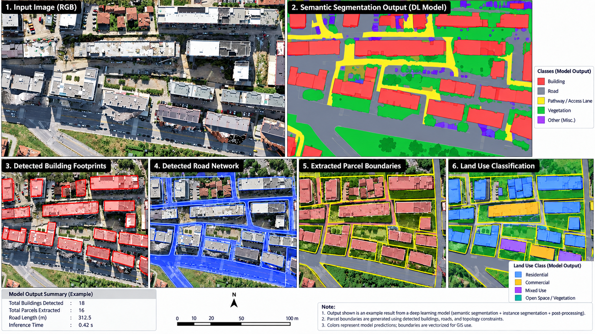
</div>

<br/>

1. **Input Image (RGB)**: High-resolution raw drone capture with calibrated ground sample distance (GSD).
2. **Semantic Segmentation Output (DL Model)**: Color-coded pixel-level mask differentiating buildings (red), roads (grey), access pathways (yellow), vegetation (green), and miscellaneous urban infrastructure.
3. **Detected Building Footprints**: Precise vectorized polygon contours isolating individual rooftop geometries.
4. **Detected Road Network**: Centerline and corridor polygon extraction for primary roads, secondary alleys, and vehicular access ways.
5. **Extracted Parcel Boundaries**: Vectorized legal parcel polygons bounding individual plots and deeds.
6. **Land Use Classification**: Automated parcel categorization into **Residential**, **Commercial**, **Mixed Use**, and **Open Space / Vegetation**.

---

## 📊 Deep Learning Validation & Model Performance

PRISM's deep learning segmentation models were evaluated across dense urban and suburban drone datasets, achieving state-of-the-art segmentation and boundary recovery scores.

### Benchmark Validation Metrics

<div align="center">
  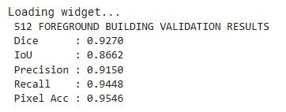
</div>

<br/>

| Performance Metric | Measured Score | Evaluation Target | Description |
|---|---|---|---|
| **Foreground Dice Score** | **0.9270 (92.70%)** | > 0.90 | Overlap similarity between predicted and ground-truth building boundaries |
| **Foreground IoU (Jaccard Index)** | **0.8662 (86.62%)** | > 0.85 | Intersection over Union for structural segmentation masks |
| **Precision** | **0.9150 (91.50%)** | > 0.90 | Low false-positive rate on non-building surface textures |
| **Recall (Sensitivity)** | **0.9448 (94.48%)** | > 0.92 | High detection rate identifying subtle and obscured buildings |
| **Overall Pixel Accuracy** | **0.9546 (95.46%)** | > 0.95 | Multi-class semantic pixel classification accuracy across the survey grid |
| **Inference Latency** | **0.42 seconds** | < 1.00s | Rapid sub-second execution per 512x512 orthomosaic tile |

---

### Training Loss Convergence & Learning Rate Schedules

PRISM employs a hybrid loss function combining **Cross-Entropy Loss** and **Dice Loss** with cosine learning rate scheduling to ensure smooth convergence without overfitting:

<div align="center">
  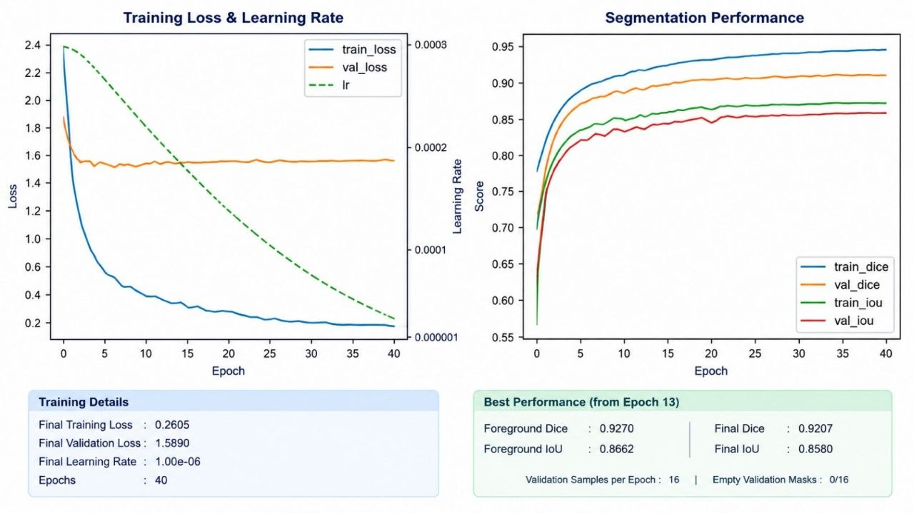
</div>

<br/>

<div align="center">
  <table>
    <tr>
      <td width="50%" align="center">
        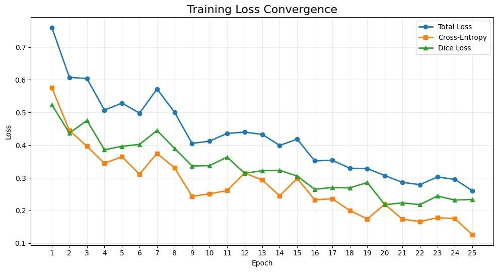
        <br/>
        <em>Fig: Total Loss, Cross-Entropy & Dice Loss Convergence over 25 Epochs</em>
      </td>
      <td width="50%" align="center">
        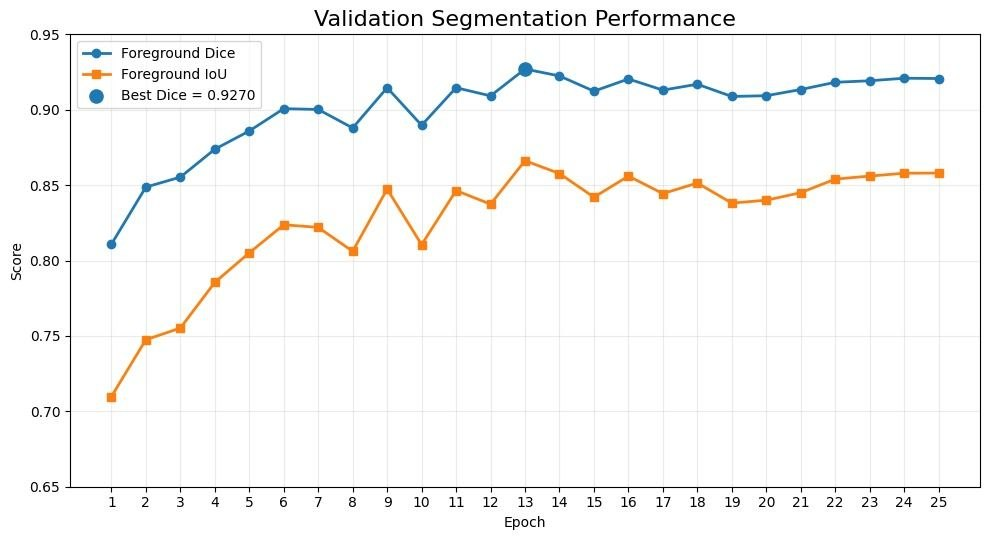
        <br/>
        <em>Fig: Validation Dice and IoU Trajectory reaching peak performance</em>
      </td>
    </tr>
  </table>
</div>

---

## 🛰 Visual Survey Results Across Diverse Landscapes

PRISM has been validated across a wide spectrum of aerial survey environments:

### 1. Multi-Class Building Instance Classification & Zoning
Automated classification of individual building footprints categorized by zoning and structural density with confidence metrics:

<div align="center">
  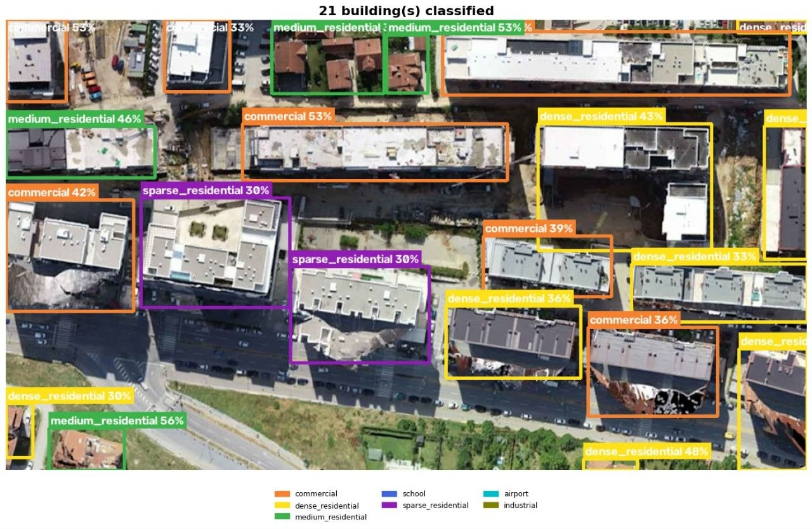
  <br/>
  <em>Multi-class detection identifying Commercial, Dense Residential, Medium Residential, and Sparse Residential buildings.</em>
</div>

<br/>

### 2. Suburban Residential Subdivision Cadastre
Automated rooftop isolation and density grading over suburban planned developments:

<div align="center">
  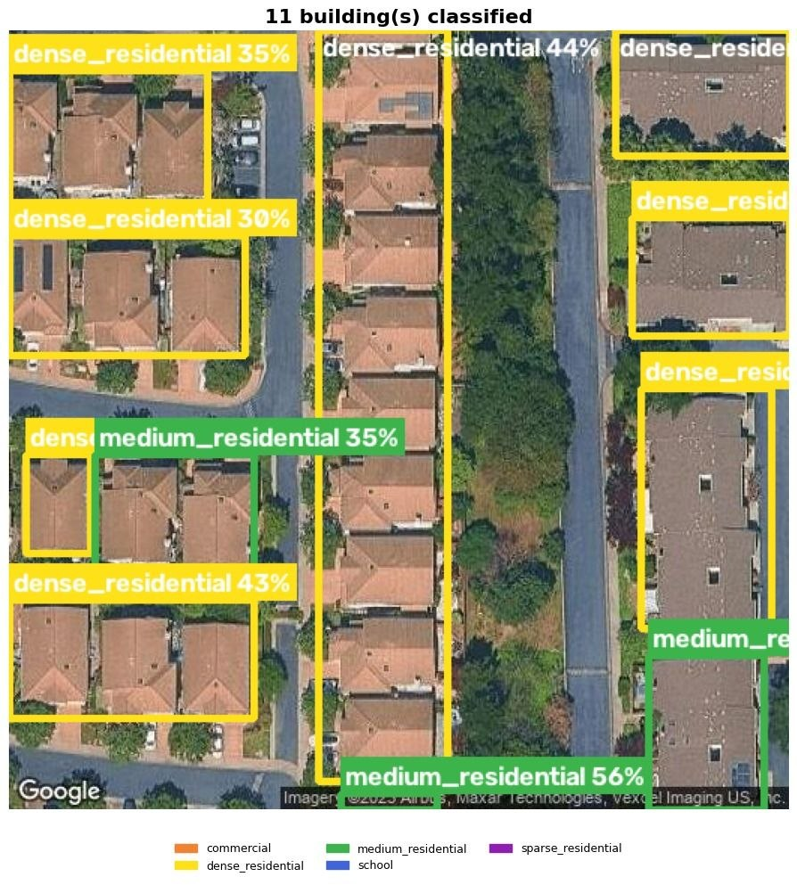
</div>

<br/>

### 3. UAVid++ Model Segmentation & Ground-Truth Overlay
Side-by-side verification comparing raw drone capture, multi-class model segmentation, and alpha-blended vector overlay:

<div align="center">
  <table>
    <tr>
      <td align="center">
        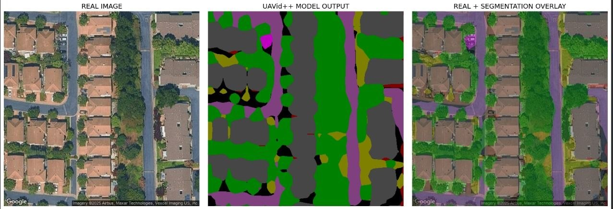
        <br/>
        <em>Suburban Residential Street Corridor (Real Image ➔ Model Output ➔ Alpha Overlay)</em>
      </td>
    </tr>
    <tr>
      <td align="center">
        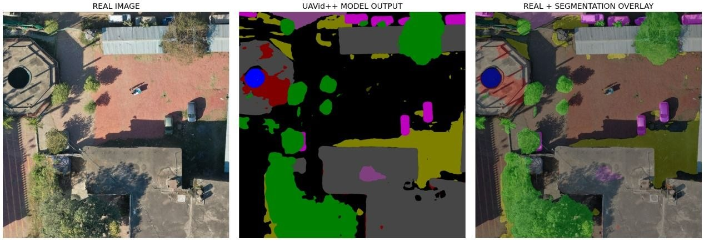
        <br/>
        <em>Courtyard & Canopy Infrastructure (Real Image ➔ Model Output ➔ Alpha Overlay)</em>
      </td>
    </tr>
    <tr>
      <td align="center">
        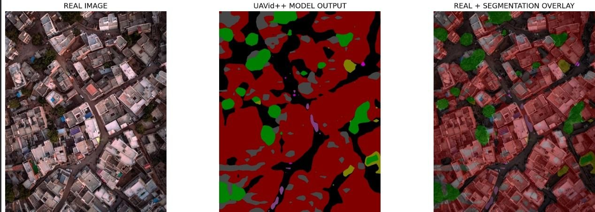
        <br/>
        <em>High-Density Urban Settlement (Real Image ➔ Model Output ➔ Alpha Overlay)</em>
      </td>
    </tr>
  </table>
</div>

---

## ✨ Key Platform Features

- **↔ Interactive Original vs AI Prediction Comparison Studio**:
  - **Swipe Split Slider (`↔`)**: Interactive draggable slider dividing the raw drone photo and the AI vector prediction with real-time clipping.
  - **Side-by-Side Dual View (`◫`)**: Synchronized viewports comparing ground truth with detected polygons.
  - **Opacity / X-Ray Blend (`◐`)**: Smooth 0% to 100% overlay blend for direct structural auditing.
- **📐 OGC Topological Rule Compliance Engine**:
  - Enforces digital deed standards with valid vertex winding and **zero boundary overlaps**.
  - Identifies encroachment risks and topology violations automatically.
- **🤖 Multimodal AI Cadastral Assistant**:
  - Embedded AI assistant for natural language spatial querying, legal setback checks, and survey deed summarization.
- **📊 Cadastral Analytics & Spatial Insights**:
  - Interactive charts illustrating land-use distribution, building coverage ratios, parcel area histograms, and model confidence metrics.
- **📑 Multi-Format Interoperability & Official PDF Generator**:
  - Export datasets to **GeoJSON**, **ESRI Shapefile (.shp)**, **AutoCAD (.dxf)**, **CSV Deed Rolls**, and official **PDF Cadastral Survey Certificates**.

---

## 💻 Technology Stack

### Frontend Application
- **Framework**: Next.js 14 (App Router, Server & Client Components)
- **Language**: TypeScript 5.0
- **Styling**: TailwindCSS with Custom Cadastral Design Tokens & Micro-Animations
- **Data Visualization**: Recharts, SVG Vector Canvas, Lucide React Icons
- **State & Caching**: TanStack Query (React Query v5)

### Backend API & Spatial Engine
- **Framework**: NestJS (Modular Architecture, REST API)
- **Database**: MongoDB Atlas with Mongoose ODM
- **Spatial Geometry**: Turf.js (OGC Topological Analysis & Polygon Geometry)
- **Document Generation**: PDFKit (Official Cadastral Survey Certificates with Stamps & Checksums)
- **Geocoding & Datum**: OpenStreetMap Nominatim / EPSG:4326 Datum

### Machine Learning & Vision
- **Framework**: PyTorch / Torchvision
- **Architectures**: UAVid++, U-Net, ResNet Feature Pyramid Networks
- **Multimodal Intelligence**: Google Gemini Vision & Reasoning API

---

## 📁 Project Directory Structure

```
prism-cadastral-platform/
├── README.md                      # Comprehensive project documentation
├── docker-compose.yml             # Container orchestration
├── readmeresultsfolder/           # Model performance curves, banners, and benchmark outputs
│   ├── Banner.png                 # Platform hero overview showcase
│   ├── PRISM PIPELINE 2.png       # 8-Stage Cadastral Pipeline Architecture
│   ├── Demo.png                   # 6-Panel Model Output Decomposition
│   ├── curveresult1.jpg           # Validation Dice & IoU Curves
│   ├── curveresult2.jpg           # Training Loss Convergence Curves
│   ├── curveresult3.jpg           # Performance Report Card & Learning Rate Decay
│   ├── result.jpg                 # 512 Foreground Building Validation Metrics
│   ├── photo_5_...jpg             # 21 Buildings Multi-Class Classification
│   └── result1.jpg - result4.jpg  # Visual segmentation overlays across diverse terrains
├── Testing Images/                # Sample aerial drone test datasets
├── backend/                       # NestJS API & Spatial Engine
│   ├── src/
│   │   ├── modules/
│   │   │   ├── imagery/           # Drone imagery upload & AI extraction
│   │   │   ├── parcels/           # Cadastral parcel polygons & topology
│   │   │   ├── buildings/         # Building footprints & heights
│   │   │   ├── roads/             # Roadway centerlines & widths
│   │   │   ├── exports/           # GeoJSON, Shapefile, PDF certificate generator
│   │   │   ├── assistant/         # AI Cadastral Assistant
│   │   │   └── projects/          # Project workspaces & metadata
│   │   ├── main.ts                # Application entrypoint
│   │   └── app.module.ts          # Root module
│   ├── package.json
│   └── tsconfig.json
└── frontend/                      # Next.js 14 GIS Workspace
    ├── public/                    # Static brand assets & logos
    ├── src/
    │   ├── app/
    │   │   ├── page.tsx           # Premium landing page & showcase
    │   │   ├── globals.css        # Core styling & light flow animations
    │   │   └── projects/[projectId]/
    │   │       ├── upload/        # Aerial image upload & Comparison Studio
    │   │       ├── analytics/     # Spatial Insights & Land-Use Analytics
    │   │       ├── exports/       # Multi-format downloads & PDF Generator
    │   │       └── assistant/     # Floating AI Cadastral Assistant
    │   ├── components/
    │   │   ├── imagery/           # ImageAiInspector (Swipe Split, Dual View, Opacity)
    │   │   ├── layout/            # ProjectTopBar & Navigation
    │   │   └── ui/                # Toast, Card, Badge, Button components
    │   └── lib/api.ts             # API client & endpoints
    ├── package.json
    └── tailwind.config.ts
```

---

## 🚀 Comprehensive Setup & Installation Guide

### Prerequisites
- **Node.js**: `v18.17.0` or higher installed
- **Package Manager**: `npm` (v9+) or `pnpm`
- **MongoDB**: Local MongoDB instance (`mongodb://localhost:27017/prism`) or MongoDB Atlas URI

---

### Step 1: Clone the Repository
```bash
git clone https://github.com/your-org/prism-cadastral-platform.git
cd prism-cadastral-platform
```

---

### Step 2: Configure & Launch the Backend API

1. Navigate to the `backend` directory:
   ```bash
   cd backend
   ```

2. Install backend dependencies:
   ```bash
   npm install
   ```

3. Create and configure your environment file (`backend/.env`):
   ```env
   PORT=4000
   NODE_ENV=development
   MONGODB_URI=mongodb+srv://<username>:<password>@cluster.mongodb.net/prism?retryWrites=true&w=majority
   GEMINI_API_KEY=your_google_gemini_api_key_here
   CORS_ORIGINS=http://localhost:3000
   ```

4. Build and run the NestJS server:
   ```bash
   # Development mode with hot reload:
   npm run start:dev

   # Or compile and run production build:
   npm run build
   node dist/main.js
   ```
   *The backend will boot up at `http://localhost:4000` with CORS enabled for the frontend.*

---

### Step 3: Configure & Launch the Next.js Frontend

1. Open a new terminal and navigate to the `frontend` directory:
   ```bash
   cd frontend
   ```

2. Install frontend dependencies:
   ```bash
   npm install
   ```

3. Configure frontend environment variables (`frontend/.env.local`):
   ```env
   NEXT_PUBLIC_API_BASE_URL=http://localhost:4000/api/v1
   NEXT_PUBLIC_GOOGLE_MAPS_API_KEY=your_google_maps_api_key_here
   ```

4. Start the Next.js development server:
   ```bash
   npm run dev
   ```
   *Open your browser and navigate to `http://localhost:3000` to access the PRISM platform.*

---

## 📡 API Endpoints & Interoperability

| Method | Endpoint | Description |
|---|---|---|
| `GET` | `/api/v1/projects` | List all cadastral mapping projects |
| `POST` | `/api/v1/projects` | Create a new cadastral survey project |
| `POST` | `/api/v1/imagery/upload` | Ingest raw drone photo / orthomosaic |
| `POST` | `/api/v1/imagery/:id/extract` | Trigger deep learning feature vectorization |
| `GET` | `/api/v1/parcels/project/:id` | Fetch vectorized legal parcel polygons |
| `GET` | `/api/v1/buildings/project/:id` | Fetch vectorized building footprints & heights |
| `GET` | `/api/v1/roads/project/:id` | Fetch extracted roadway network corridors |
| `GET` | `/api/v1/exports/imagery/:id/report.pdf` | Download official Cadastral Survey Certificate PDF |
| `GET` | `/api/v1/exports/projects/:id/parcels.geojson` | Export georeferenced OGC GeoJSON |
| `GET` | `/api/v1/exports/projects/:id/shapefile.zip` | Export ESRI Shapefile bundle |
| `POST` | `/api/v1/assistant/chat` | Query the Multimodal AI Cadastral Assistant |

---

## 📜 License & Compliance

PRISM is developed to comply with **OGC (Open Geospatial Consortium)** spatial standards and **ISO 19152 Land Administration Domain Model (LADM)** guidelines.

---

<div align="center">
  <sub>Built with precision for the future of land administration and autonomous GIS intelligence.</sub>
</div>
